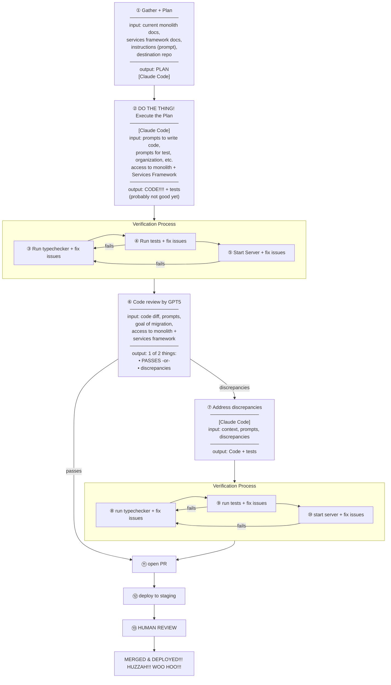

## Problem

Datadog WebApp Monolith
- thousands of HTTP routes
- need to be migrated to Services Framework

**Goal:** Decommission Datadog monolith! Rewriting and/or getting rid of

**Technologies:** Python, Claude Code, GPT5, LangGraph, Temporal

---

## Workflow

---

## Room for Improvement

- not always passing integration testing
- How to measure success? + consistency
- modernize while migration

## What's Good

- exploratory + validating THIS WORKFLOW HAS GREAT POTENTIAL
- continuous improvement
- Workflow has run successfully
