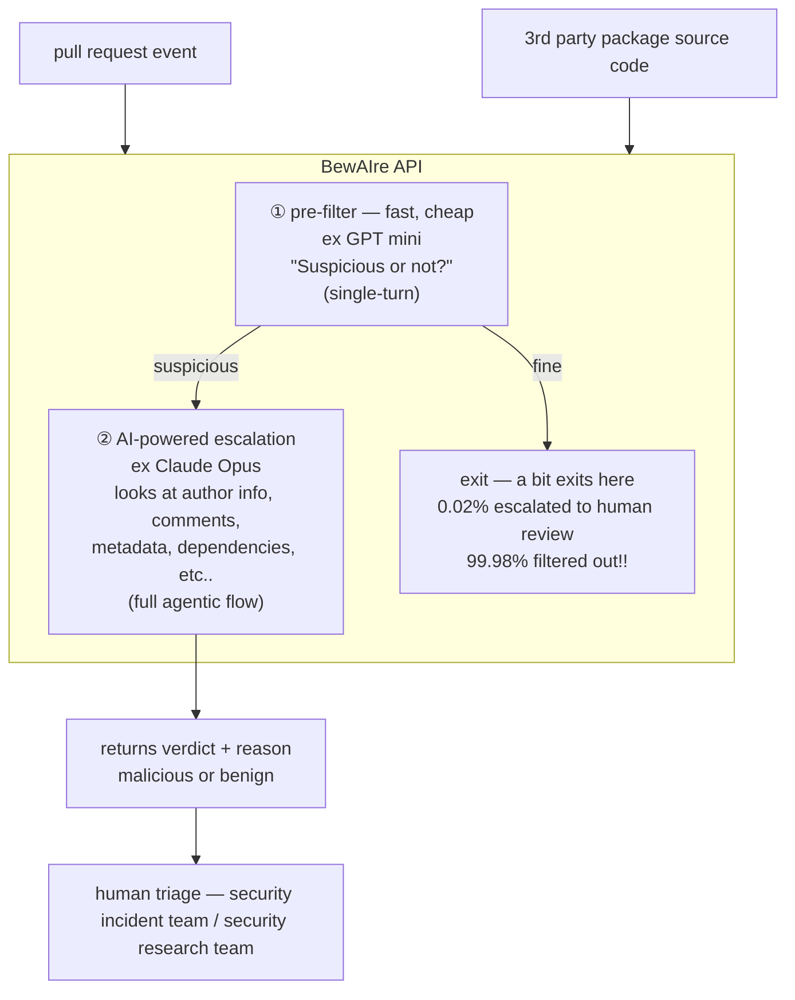

# HOW DATADOG DETECTS MALICIOUS CODE AT SCALE

malicious code ≠ vulnerabilities

## The Attack Surface

**Vector 1** ⚡ pull request
example: exfiltrate secrets via CI config

**Vector 2** ⚡ packages
example: attacker compromises pkg maintainer, backdoor ships in next update

BewAIre is software that automatically analyzes pull requests and packages to detect malicious changes

## How It Works

## How It Scales

✱ Scanning every PR event
✱ Scanning every package release

scales because of this fast + cost effective step
also scales because of this step's precision

## BewAIre Detects:

✱ token exfiltration!
✱ encoded payloads!
✱ backdoors!
✱ typosquatting!
AND MORE!

## What's Next:

- stronger enforcement
- improving + extending package scanning
