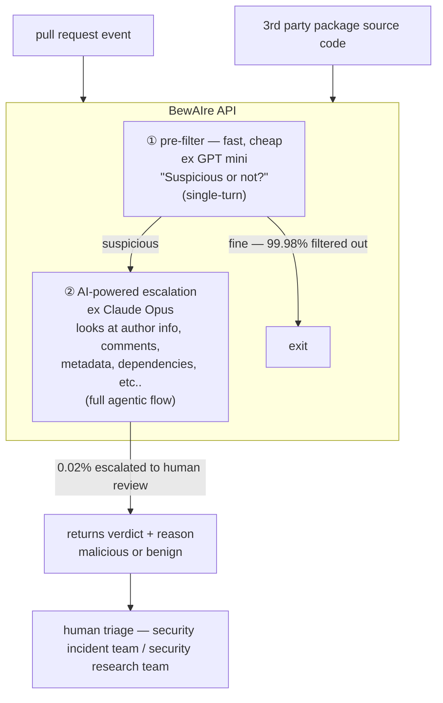

# HOW DATADOG DETECTS MALICIOUS CODE AT SCALE

malicious code ≠ vulnerabilities

## The Attack Surface

- **Vector 1** ⚡ pull request
  - example: exfiltrate secrets via CI config
- **Vector 2** ⚡ packages
  - example: attacker compromises package maintainer, backdoor ships in next update

BewAIre is software that automatically analyzes <u>pull requests</u> and <u>packages</u> to detect <u>malicious changes</u>

## How It Works

## How It Scales

☆ Scanning every PR event 
☆ Scanning every package release 

scales because of the fast + cost effective step 1 ↑ 
also scales because of step 2's precision ↑

## BewAIre Detects:

☆ token exfiltration! 
☆ encoded payloads! 
☆ backdoors! 
☆ typosquatting! 
AND MORE!

## What's Next:

- stronger enforcement
- improving + extending package scanning
