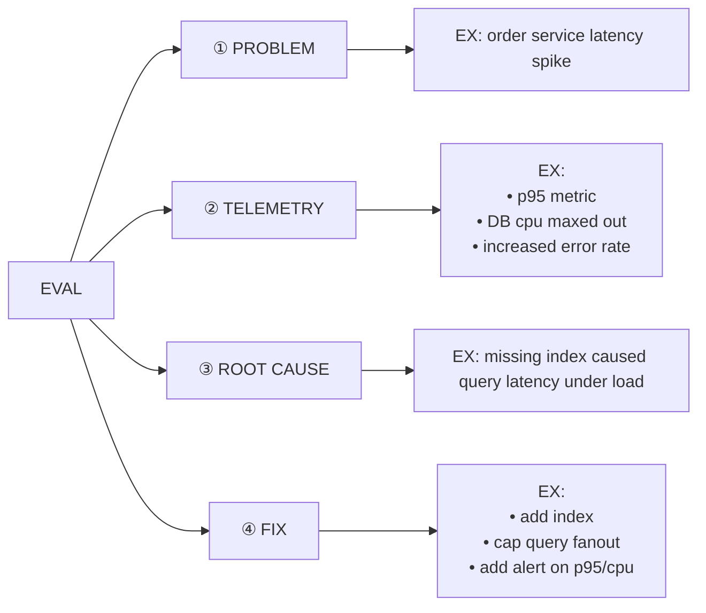
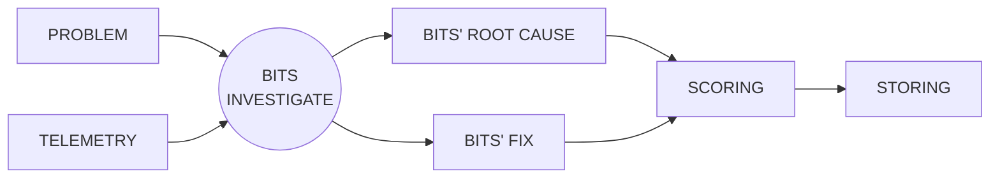

**Bits Investigate** is an autonomous, end-to-end production investigation AI agent

Getting Bits Investigate Quality Right

☆ High Stakes
- critical to get right

☆ Huge Scope
- many domains in parallel
  ex app code, infra, DBs
- limitless incident shapes

☆ Interconnectivity
- many many surfaces
  ex API call, tool, skill, a Datadog product

Why EVALS (not tests)?
Evals understand scope + track behavior over time

---

Next to the TELEMETRY example: **"The world"** — Noise is good! ← PROD has noise so eval platform should too

PLATFORM should handle change
- eval collection built into platform
- user feedback spawns evals
- also technology landscape changes

---

**Running an eval**

inputs - "the world" (PROBLEM, TELEMETRY)
BITS INVESTIGATE does its thing!
outputs (BITS' ROOT CAUSE, BITS' FIX)
SCORING — did Bits do a good job?
STORING — store behavior of a bajillion eval runs

PERFORMANCE over time

**Segmentation** — metadata added to an eval
examples of segments: underlying failure mode, surface, complexity/difficulty. limitless

Helps stakeholders understand their piece of Bits Investigate

When scoring, look at:
- correctness
- reasoning
- what surfaces
- level of effort

Regression catching
- run evals regularly
- detect regressions
- alert
- surface early
