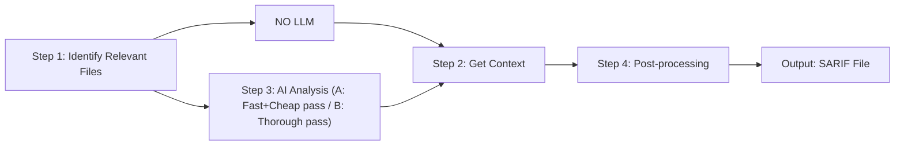

## Static Application Security Testing (SAST)

- Scans source code to find vulnerabilities
- uses pattern matching

**PROBLEMS**
- high false positive rate
- doesn't have context of surrounding files

---

AI-Native SAST uses LLMs to reason about code instead of relying on patterns

Finds vulnerabilites without so many false positives & with more context

**UNDERSTANDS**
- code semantics, data/execution flow, code usage, context

---

**EXAMPLE USE CASE**
Devs make a service that feeds app logs to an LLM for sentiment analysis & caterorization

---

**OWASP** - Open Web Application Security Project

**Benchmark** → Industry standard

AI-Native SAST improved Datadog's OWASP score by 50%

## AI-Native SAST

*Triggered by Git operations*

### Step 1: Identify Relevant Files

- ★ Doesn't Analyze whole repo
- ★ uses cached results
- use heuristics, keywords
- **EX**: Flags a file w an input going straight to [illegible]

### Step 3: AI Analysis

**A** — Fast + Cheap LLM pass
- yes or no, smaller model
- more false positives
- **EX**: sees no sanitization → (FLAG)

**B** — Thorough LLM pass
- reasoning model
- deep analysis
- output: yes or no with reasoning
- What, Where, Why, When
- **EX**: Traces full flow. Confirms issue & says why

## How It Works

### Step 2: Get Context

(arrow → NO LLM)

- Builds context for data flow analysis
- cross-file context
- **EX**: build context for the file that was flagged in step 1. Sees that user logs direct to LLM

### Step 4: Post-processing

(output: SARIF file)

**FIRST: CACHE RESULTS** ★
- If Benign → Drop it
- If Vulnerable → Keep, and...
- , output SARIF file
- Use SARIF file to surface issues to users as alert, in IDE, in pull request in Datadog UI
- **EX**: Results surfaced to devs w/ reasoning + actionable steps

**OPTIMIZING COST** ★ = cost optimizing
- ★ full repo scanned only at onboarding

