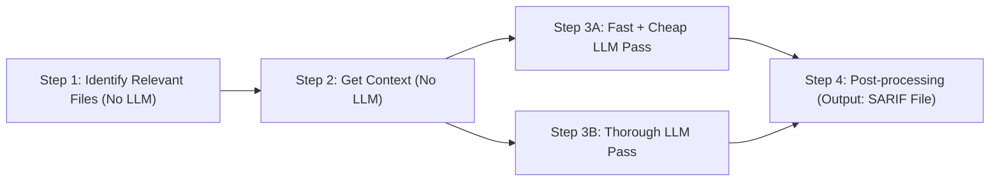

## Static Application Security Testing (SAST)

- Scans source code to find vulnerabilities
- Uses pattern matching

**PROBLEMS**
- High false positive rate
- Doesn't have context of surrounding files

---

## AI-Native SAST

AI-Native SAST uses LLMs to reason about code instead of relying on patterns. It finds vulnerabilities without so many false positives and with more context.

**UNDERSTANDS**
- Code semantics
- Data/execution flow
- Code usage
- Context

---

**EXAMPLE**
Devs make a service that feeds app logs to an LLM for sentiment analysis and categorization

---

**OWASP Benchmark** → Industry standard

**O**pen **W**eb **A**pplication **S**ecurity **P**roject

AI-Native SAST improved Datadog's OWASP score by 50%.

## AI-Native SAST: How It Works

*Triggered by Git operations*

### Step 1: Identify Relevant Files

(NO LLM)

- ★ Doesn't Analyze whole repo
- ★ Uses cached results
- Use heuristics, keywords
- **EXAMPLE**: Flags a file w an input going straight to LLM

### Step 2: Get Context

(NO LLM)

- Builds context for data flow analysis
- Cross-file context
- **EXAMPLE**: Build context for the file that was flagged in step 1. Sees that user logs direct to LLM

### Step 3: AI Analysis

**A** — Fast + Cheap LLM pass
- Yes or no, smaller model
- More false positives
- **EXAMPLE**: Sees no sanitization → (FLAG)

**B** — Thorough LLM pass
- Reasoning model
- Deep analysis
- Output: yes or no with reasoning
- What, Where, Why, When
- **EXAMPLE**: Traces full flow. Confirms issue and says why

### Step 4: Post-processing

(output: SARIF file)

**FIRST: CACHE RESULTS** ★
- If Benign → Drop it
- If Vulnerable → Keep, and...
  - Output SARIF file
- Use SARIF file to surface issues to users
  - Alert
  - IDE
  - Pull request
  - Datadog UI
- **EXAMPLE**: Results surfaced to devs w/ reasoning + actionable steps

**OPTIMIZING COST**
★ = cost optimizing
- ★ Full repo scanned only at onboarding

