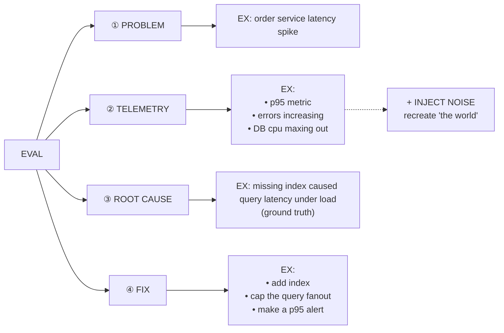
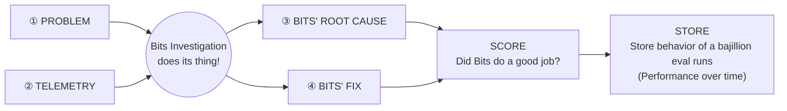

## Bits Investigation

Bits Investigation autonomous, end-to-end production investigation agent

### Why are Investigation Evals unique???

- **High Stakes**
  - critical to get right
- **Ginormous Scope**
  - many domains in parallel
  - ex hardware, app, infrastructure
- **Interconnectivity**
  - many many surfaces
  - ex tool calls, networking, etc, traces, API calls, other Datadog products

### Why EVALs (not tests)?

Discrete tests of tools, etc goes stale fast & don't give full picture

Helps stakeholders understand their part

---

## EVAL

**SCALABLE EVAL creation system**
- real use powers EVAL creations
- internal incidents
- this captures new tech

---

## Running an eval

"the world" — Problem + Telemetry (inputs)

**When scoring, look at:**
- correctness
- reasoning
- what surfaces
- level of effort

**catching regressions**
- run evals regularly
- detect regressions
- alert
- surface problems early

**"Slice n-dice" evals using metadata**
- EX: product area
- surfaces
- complexity — limitless!
