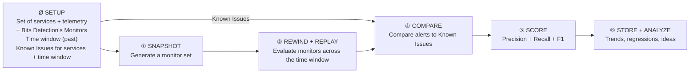

## What is Bits Detection?

Evaluates production behavior to determine healthy baselines. Identifies which endpoints have most risk, then automatically creates + tunes monitors for these services

---

## What's uniquely hard about evaluating Bits Detection?

- Very hard to define what makes a monitor "good" — think of a monitor as a prediction function
- Very hard to have a ground truth for this — use a classifier agent to find "known issues" from data
- "Good monitoring" means different things for different services & different customers

## How the eval system works – Step by Step

### Ø SETUP

- Set of services + telemetry
- + Bits Detection's Monitors
- Time window (past)

Known Issues for services + time window

### ① SNAPSHOT

**Input:** Set of services + time window
**Action:** Generate a monitor set
**Output:** The monitors at the beginning of the time window

### ② REWIND + REPLAY

**Input:** Monitors at beginning of time window
**Action:** Evaluating those monitors across the whole time window
**Output:** Alerts that happened during replay

### ④ COMPARE

**Input:** Alerts + Known Issues
**Action:** ① Compare each alert to Known Issues ② Investigate further if needed
**Output:** Each alert classified:

| | |
|---|---|
| Caught issue | Found issue |
| Missed issue | Alerted wrongly |

### ⑤ SCORE

**Input:** Classified alerts
**Action:** Calculate

① **Precision:** How many alerts were good alerts?
② **Recall:** Of all known issues, how many were caught?

**Output:** Precision Score, Recall score, Combined score (F1)

### ⑥ STORE + ANALYZE

**Input:** This eval's score, plus all evals ever
**Action:** Storing + analysis
**Output:** monitor shape comparison, quality trends, detects regressions, ideas for improving Bits Detection
