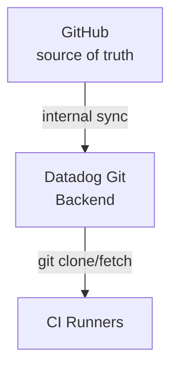
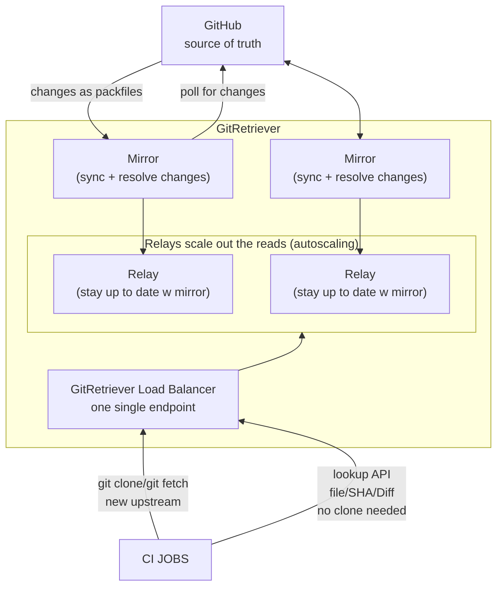
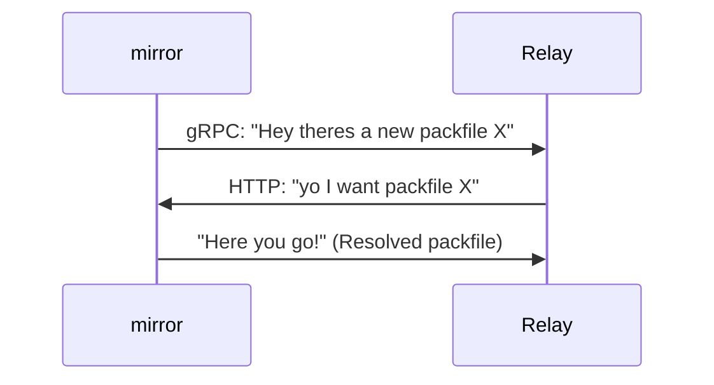

## The Problem

- ★ CI slow + many outages
- ★ AI coding agents 10x Git traffic
- ★ Tried:
  - add backend nodes ✗
  - add CDN/cache ✗
  - have CI fetch straight from GitHub ✗

---

## How Git Fetch Works

**client - CI runner:** "This is what I *have* in my Git. This is what I *want* from your Git"

**server - Datadog Git backend:** "Okay! I'll compute what changed + send it in a Packfile"

reference (ref) = pointer to a commit

---

## GitRetriever = self-hosted Git Mirror

---

## mirror: a closer look

| changed refs | parallel fetches | thin packfile | resolve once | resolved packfile |
|---|---|---|---|---|
| fetch changed refs in parallel + save to memory | | trade higher mirror CPU for speed | | reused by relays |

---

## relay: closer look*

- Relay: Auto-scaling
- \* this happens in parallel

---

## Results!

- ~20x traffic flat latency
- 100m+ req/week
- ~10 ms lookup
- ~5500 repos
- 3-4x lower CPU
- sec → ms sync
