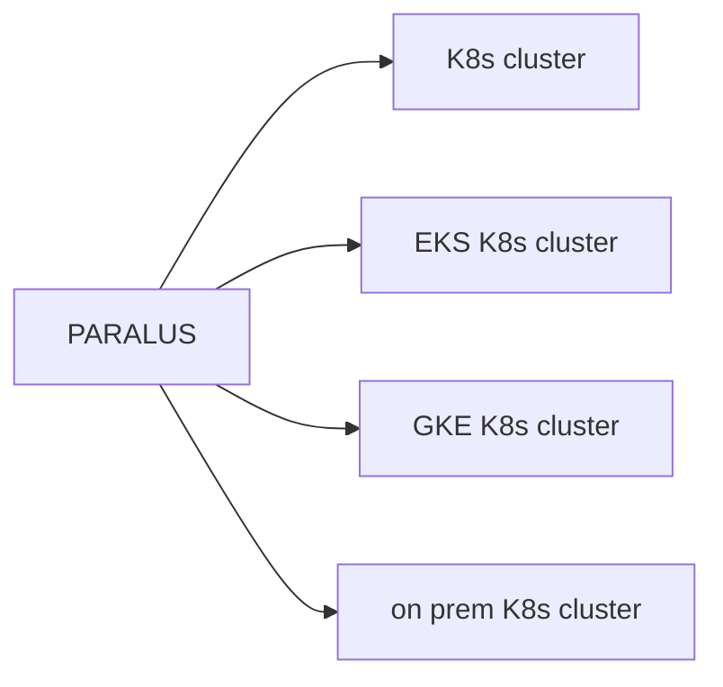

## Before Paralus

Whitney (Dev) ↔ Devops → Use RBAC creates roles for each user

### Problems with this method

- hard to scale RBAC
  - Assign a user to team
  - Assign a user to role for that role for access
- hard to audit
  - admins don't always know who has access to what
- hard to integrate w/ external providers (e.g., GitHub, GitLab)
- tedious, manual process
- dormant Scale

---

## Paralus is a tool that helps you simply streamline RBAC operations, while enhances security

---

## Set Up Paralus

1. Dev sets up devices for devs to dev namespace
2. Devops ties group to dev namespace to single sign on
3. What happens when people leave the company → devops easily removes from the group
4. The devs who can access the dev namespace

---

## After Paralus (many → 100s of devs)

### DIY Operations

- Devs can: access Paralus dashboard (log in via SSO)
- Devs can only access their dashboard & workspace (dev namespace)
- Devs can customize their dashboard
- Devs can use custom permissions

---

## PARALUS MAIN POINTS

### 1. AIDS IN AUTHENTICATION
- by integrating w/ many SSO providers

### 2. ACCESS CONTROL
- Access to one or many clusters
- admins can create projects for dev, staging, prod, and enforce it to role

### 3. AUDITABILITY
- tracks all user activity
- tracks kubectl activity
- provides reports

### 4. Paralus dashboard
- shows what you can access
- can manage many clusters at once

### 5. If a dev leaves
- it is a one-click experience to remove from groups
- See access history
- Open Paralus dashboard
