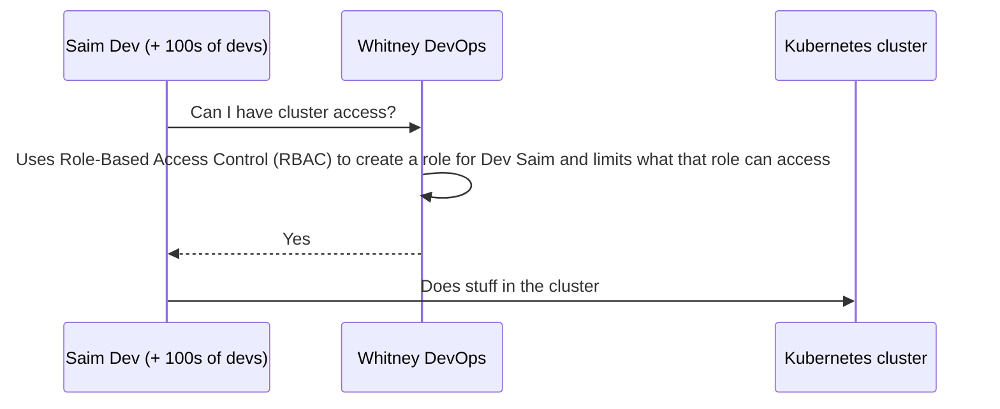
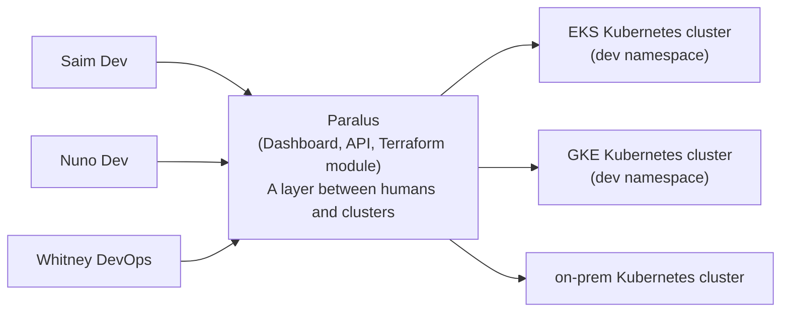

## Before Paralus

### Problems with this method

1. Hard to scope RBAC
   - Might give too much or too little access
2. Hard to audit
   - Weeks from now, how do you know who has access to what?
3. Hard to integrate with integration providers
   - For example, GitHub and GitLab
4. Tedious manual process
   - Write YAML for role, write YAML for role binding
5. What happens when people leave the company?
   - Scripting is often used for this
6. No troubleshooting mechanism
7. Doesn't scale

---

## Paralus is a tool that helps you simplify and streamline RBAC operations, which enhances security

---

## Set Up Paralus

1. Dev asks DevOps for access to dev namespace
2. DevOps accesses Paralus dashboard with Single Sign-On (SSO)
3. DevOps eng creates a Dev group and adds Dev engineer Saim to the group
4. The Paralus Dev group is made up of people who can access the dev namespace

---

## After Paralus (many → 100s of devs)

---

## PARALUS MAIN POINTS

### 1. Aids in authentication
- By integrating with many SSO providers

### 2. Access control
- People can access one or many clusters
- Cluster admins can create and enforce policies based on identity and role

### 3. Auditability
- Logs all interactions
- Tracks kubectl history
- Assists in troubleshooting
- Provides terminal and dashboard

---

## Day Two Operations

☆ Dev Saim accesses Paralus dashboard, logs in via SSO
  - Dev can only see the namespace they have access to
  - Layer between devs and clusters

☆ DevOps engineers can use predefined roles instead of building their own

☆ Devs can customize their dashboard and workspaces based on org policies

☆ Paralus dashboard shows dev what access they have to many clusters at once

☆ If a dev leaves, it is a one-click experience to remove permissions

☆ Troubleshoot from the Paralus dashboard

☆ See access history from Paralus dashboard
