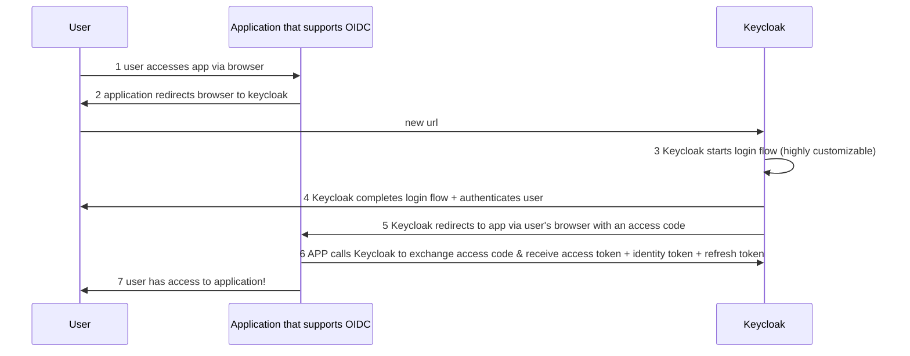

## Before Keycloak... 10 years ago
- every app needs a unique username/password (ANNOYING)
- many different access management protocols
- Open ID Connect (OIDC) was new

## Identity & Access Management (IAM)
*(Keycloak does all this)*
- register user for first time
- password recovery
- multi-factor authentication (2FA)
- administrator can assign roles
- how a user authenticates
- manages both users + clients
- fine-grained authorization *(preview feature)*
- log-in flows

**Keycloak is the open source Identity + access management solution**

## Log-in Flow (what the user sees)

log-in forms customizations:
- required actions, like 2FA
  - confirming email
  - LOTS of stuff
- form can be hidden altogether
  - example if they have a OIDC token already
- many plug-ins available, also write your own

## Installing Keycloak
3 ways!
- download + install archive
- download + install container
- use Keycloak Kubernetes operator

## Administrator Experience
UI organized by Realms
- initial admin realm
- create your own realms
  - users stored in realms or database
  - configure clients here
  - register applications
- for example:
  - production realm
  - internal users + apps
- or use different Keycloak instances

*(find Alex in CNCF Slack)*

## Types of tokens
- Access token = usually used to access services (opaque)
- Identity token = describes identity of user
- Refresh token = can be used to get new access tokens without login

## Open ID Connect Flow → very easy to integrate w Keycloak
THREE PARTIES

1. user accesses app via browser
2. application redirects browser to keycloak
3. Keycloak starts login flow (highly customizable)
4. Keycloak completes login flow + authenticates user
5. Keycloak redirects to app via user's browser with an access code
6. APP calls Keycloak to exchange access code & receive access token + identity token + refresh token
7. user has access to application!

## Keycloak Benchmark Project!
- generate data for load testing
- load driver
  - creates concurrent logins
- describes how to use the metrics
- comes w/ setup & best practices
