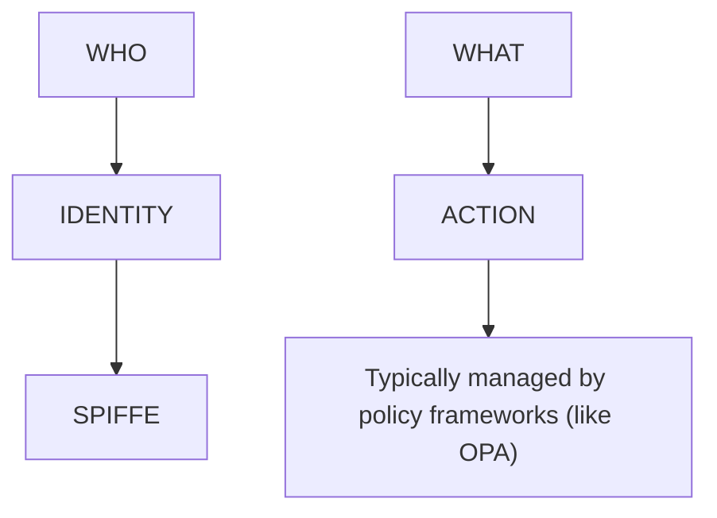
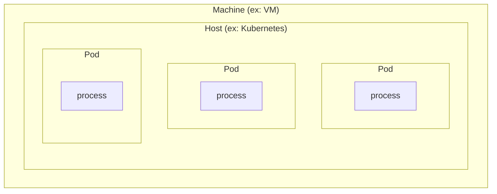

## Before SPIFFE

- Workloads communicated
  - via service tokens
    - need to be stored
    - sometimes hard coded
    - hackers can extract
  - via mTLS
    - certificates have to be managed/rotated
- Tokens used to verify tokens.
- Certificates used to verify certificates.

---

## SPIFFE Definition

<u><strong>S</strong></u>ecure <u><strong>P</strong></u>roduction <u><strong>I</strong></u>dentity <u><strong>F</strong></u>ramework <u><strong>F</strong></u>or <u><strong>E</strong></u>veryone (SPIFFE) is a standard for securing and identifying workloads in a production environment. It's a secure and automated way to manage identity.

---

## WHO + WHAT = POLICY

Identity is best added to processes.

Identity can be added to any layer, but...
- Machine layer doesn't play well with other machines
- Host layer deals with IP addresses, but those can change

BEST TO ADD IDENTITY TO PROCESSES (WORKLOADS)

---

## SPIFFE Is Designed to Solve These Problems

- Standard for formatting an ID = SPIFFE ID (it looks like a URL)
- SPIFFE Verify = proves that a workload is what it claims to be

---

## SVID

<u><strong>S</strong></u>PIFFE <u><strong>V</strong></u>erifiable <u><strong>I</strong></u>dentity <u><strong>D</strong></u>ocument

- A bundle of PKI certs/keys
- SVIDs are short-lived
- If two workloads each have their own SVIDs, they can establish a secure connection between each other

---

## Workload API

- Workloads attest themselves in order to gain access to the Workload API
- Workload API gives SVIDs to workloads
- User configures how attestations are verified
- Workload API can verify the attestation by querying other stuff in the environment
  - Examples: might query kubelet, might query OS, might check SHA hash, plug-ins used here
- Once this process is complete, Workload API issues SVID
- Workload API rotates, revokes, distributes, and compartmentalizes the SVID

---

## Benefits of SPIFFE

- Well supported
- Neither your platform nor your workloads need certificates/tokens
  - There is no spoon
- SPIFFE manages a potentially complex cross-platform/cross-cloud identity layer
- No more need for secrets management
- Scales well
- Short lived SVIDs are more secure than long-lived X509 certs

---

## SPIRE Definition

<u><strong>S</strong></u><u><strong>P</strong></u><u><strong>I</strong></u>FFE <u><strong>R</strong></u>untime <u><strong>E</strong></u>nvironment (SPIRE) is a reference implementation.

- SPIRE Server talks to SPIRE Agent
- Each SPIRE Agent has its own Workload API
- SPIRE Server - typically a stateful set, this software stores and distributes SVIDs
- SPIRE Agents - typically a daemon set, receives SVIDs from server and exposes Workload API, and does the work of verifying workloads and giving them SVIDs
